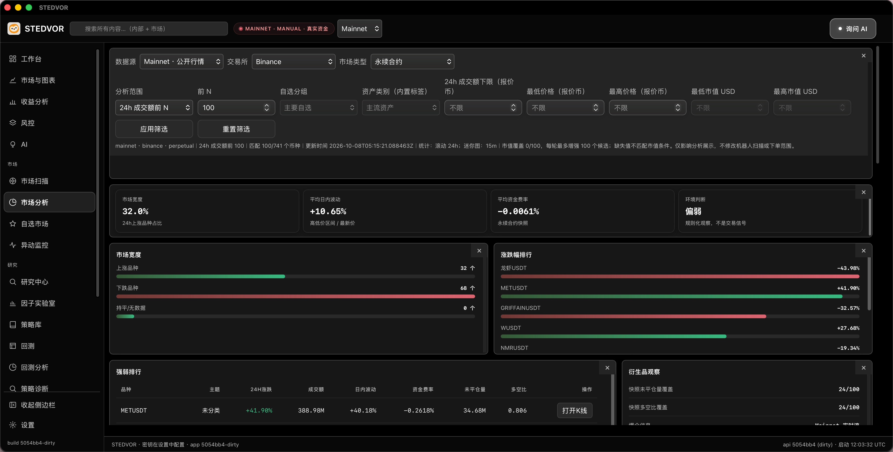
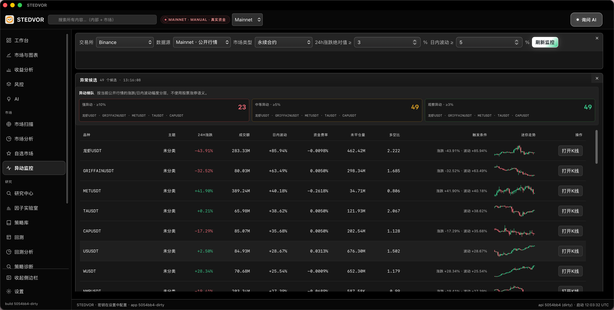
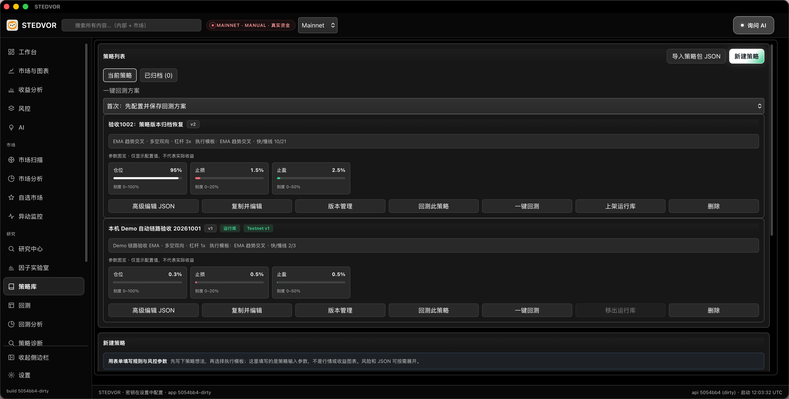
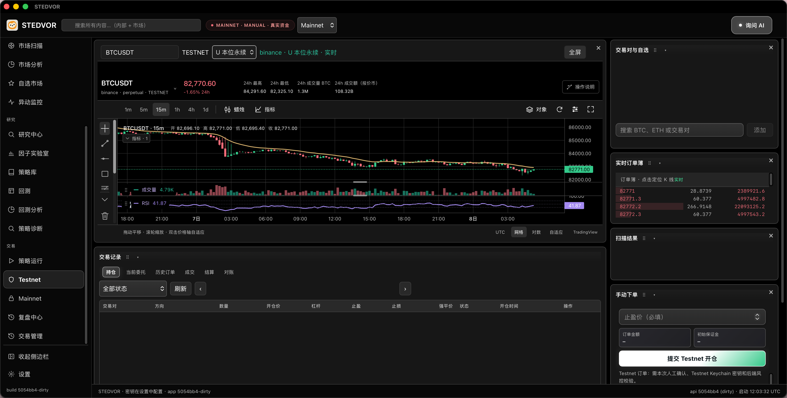
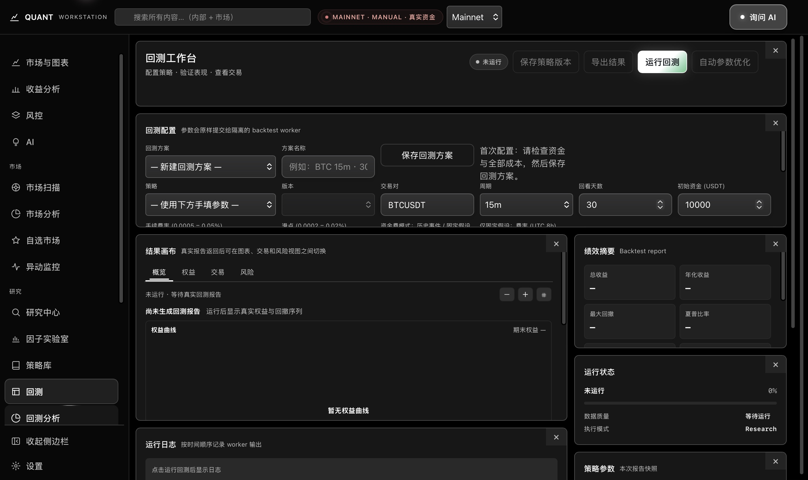
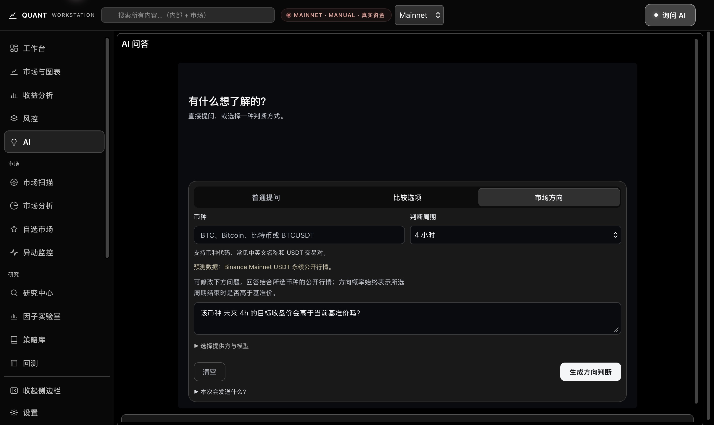

  

<h1 align="center">STEDVOR</h1>

A desktop quantitative workstation for market observation, research, Testnet execution and record review.

<strong>Product preview</strong> · macOS Apple Silicon candidate · Basic stays free · Basic preview available

  <a href="README.md">简体中文</a> ·
  <a href="docs/quick-start.md">Quick start</a> ·
  <a href="#features-and-screenshots">Features and screenshots</a> ·
  <a href="#editions">Basic / Full</a> ·
  <a href="#platform-and-downloads">Platform and downloads</a> ·
  <a href="docs/feedback.md">Feedback</a>

STEDVOR is for individuals and small teams who want to connect market observation, factor experiments, strategy research and test execution. Start with a market list, inspect market breadth and unusual moves, organize a research hypothesis, compare historical results, and practice execution and record review on Testnet.

The desktop workspace keeps these steps together while showing data sources, coverage, strategy versions and execution environments, so you can understand where a result came from and which inputs are missing.

*An actual development-build interface. Click any screenshot to open the original. Prices and indicators are public market snapshots captured at that time.*

> **Screenshots and editions:** These screenshots show the current development build, including modules outside free Basic. Mainnet public market data, the global mode badge and a page's Testnet execution environment have distinct meanings. Screenshots do not prove live account access, fills or returns. See the [edition scope](docs/editions.md).

## Get started with free Basic

1. Check the [system requirements](docs/system-requirements.md): Apple Silicon / arm64, with a bundled-runtime compile minimum of **macOS 26.0**.
2. Download the ZIP, checksum and third-party notices from the [Basic preview release](https://github.com/qaqdjh/STEDVOR/releases/tag/basic-v0.1.0-preview.1), then follow the [quick-start guide](docs/quick-start.md) to check and install them.
3. Open **Market Scanner**, select Testnet public markets, Binance and Perpetual Contract, then select **Refresh Market Data**. Basic public markets need no exchange or AI key and place no orders.

Basic is covered by separate [free-preview use terms](docs/basic-preview-terms.md). First-install, native UI and real Testnet acceptance are pending. See the [release notes](docs/release-notes.md) for changes and limitations.

## What you can do

| Your task | How the workspace helps |
| --- | --- |
| Find markets worth investigating | Filter and sort candidates, inspect mini charts and save filter presets. |
| Put a move in market context | Compare market breadth, volatility, funding rates and data coverage. |
| Follow unusual market activity | Set change and volatility thresholds and inspect the reasons a candidate matched. |
| Examine a research idea | Run factor statistics and factor return backtests; use Full's strategy workflow for versioned strategy research. |
| Practice execution and inspect records | Use manual or bot execution on supported Testnet products and review orders, fills, settlement and reconciliation. |

## Features and screenshots

### Market scanner: compare candidates in one list

Inspect prices, 24-hour changes, turnover, intraday volatility, funding rates, open interest and RSI where available. Configure fields, filters and sorting, save presets, view mini candlestick charts and open a candidate's chart.

Source, freshness and coverage information remain visible. Missing fields are not treated as zero. Enhanced sources such as CoinGecko depend on your configuration; basic scanning does not require registering with those providers first.

The opening screenshot shows this list. Here, Mainnet can identify public market data without establishing access to a real-money account.

### Market analysis: understand the wider market

Organize a universe by exchange, product, turnover range and filters. Compare market breadth, change rankings, average volatility, funding rates and derivatives coverage to place an individual market in context.

*The page explicitly uses Mainnet public market data. Environment descriptions such as “weak” are rule-based observations, rather than trading instructions or measured prediction accuracy. Full market analysis belongs to the planned paid scope.*

### Market monitor: inspect why a candidate matched

Set change and intraday-volatility conditions and organize matching markets into an observation list. Each row retains trigger conditions, available indicators and a mini chart, so the reason for inclusion stays visible.

*The screenshot shows candidate groups, conditions and public market data. A match is for observation; it does not establish that a bot started or an order was generated.*

### Factor lab: investigate a historical hypothesis

Organize formulas and templates, run statistical experiments, compare results and save candidates. Factor return backtests expose research outputs such as costs, equity and drawdown. Reports and exports help retain inputs and results for later comparison.

Factor statistics and factor return backtests belong to the confirmed free Basic scope. Research candidates are kept distinct from execution strategies; saving a candidate does not authorize trading.

### Strategy library: manage rules, parameters and versions

Full's research workflow brings together configurations, versions, archiving and backtest entry points. Saved setups support testing a specified version and examining historical returns, drawdown and costs. Parameter optimization operates within supported templates and input conditions.

*These are acceptance and Demo configurations. Position size, leverage, stop-loss and take-profit numbers are inputs, rather than actual positions, returns or recommended settings. Run-library and Testnet version badges do not prove that a bot is running. The general strategy library, one-click strategy backtests and optimization belong to the planned paid scope.*

Current one-click strategy backtesting targets supported USDT-margined perpetual workflows. Optimization has template and input restrictions; support is not claimed for arbitrary markets or strategies. Basic retains the strategy selection, parameters, saved versions and explicit start controls needed for Testnet bots.

### Testnet: connect charts, execution and records

Inspect a product's chart, indicators, market order book, positions and order records in the Testnet workspace. Manual orders require checking inputs and environment. Bots require explicit configuration, enablement and start; trade management retains cancellation, settlement, reconciliation and recovery workflows.

*The page labels, records area and submit button identify Testnet. The positions table is empty and no fill is shown. The global header still displays Mainnet; that header must not be used to interpret this page as a Mainnet order or live trading result.*

Manual trading and automated bots on supported Testnet products belong to free Basic. Required credential protection, risk controls, order protection, reconciliation, exports and recovery are included in that workflow.

### Backtesting and AI: support research and interpretation

Strategy backtests help examine historical performance, drawdown and costs. AI supports general questions and research assistance using your configured provider, model, key and quota. Historical tests and AI outputs need further evaluation; they do not guarantee future returns or prediction accuracy.

View the existing backtest and AI interfaces

*This existing image shows a setup that has not been run. The 10,000 starting capital is a research input, rather than an account balance or profit. General strategy backtests belong to Full; Basic includes factor return backtests.*

*This existing image shows the AI entry and configuration interface, with no generated answer, forecast or measured accuracy. Third-party quotas and fees are separate.*

See [screenshot context](docs/screenshots.md) for the full notes.

## A typical workflow

1. **Observe:** Build candidates with scanning and monitoring; check source, freshness and missing inputs.
2. **Research:** Examine a factor hypothesis with statistics and return backtests; use Full's workflow when general strategy research is needed.
3. **Compare:** Fix inputs, versions and cost assumptions, compare results and retain reports.
4. **Test:** Configure manual or bot execution on supported Testnet products and check parameters and environment before acting.
5. **Review:** Inspect orders, fills, settlement and reconciliation before adjusting the next experiment.

This describes the product workflow. Edition entitlements and support for each trading product must be checked separately.

## Editions

**Basic stays free long term. Full is planned as a paid edition.** Third-party AI and enhanced data accounts, keys, quotas and fees are separate.

| Capability | Basic: confirmed free scope | Full: planned paid scope |
| --- | --- | --- |
| Dashboard, scanning and market monitor | Included | Included with the full market-analysis workflow |
| Factor statistics and factor return backtests | Included | Included with wider strategy research |
| Testnet manual trading and bots | Included for supported products | Included |
| Required risk controls, order protection, reconciliation, exports and recovery | Included | Included |
| Full market charts, watchlists and market analysis | Components needed by free pages remain | Full pages belong to Full |
| Research centre, general strategy library, one-click backtests and optimization | Necessary bot configuration remains | Full research workflow belongs to Full |
| Mainnet account access, manual and automated trading | Not included | Planned, subject to support and authorization |

Basic has nine pages: **Dashboard, Performance, AI, Market scanner, Market monitor, Factor lab, Testnet, Trade management and Settings**. Account, trading, bot and performance contexts are limited to Testnet; public market data is handled separately.

Full is planned as a closed-source commercial edition with monthly subscriptions. Subscriptions are not open; official pricing, payment, licence issuance and activation arrangements will be stated before launch. See the [edition details](docs/editions.md) and [licensing and source policy](docs/licensing.md).

## Platform and downloads

| Item | Current status |
| --- | --- |
| Current package macOS compile minimum | **26.0**, Apple Silicon / arm64; runtime compatibility is still pending. See [system requirements](docs/system-requirements.md). |
| macOS Apple Silicon Basic candidate | A separate candidate has been generated and checked offline for build, trimming and packaging. |
| Public Basic free-edition installer and download link | [0.1.0 preview](https://github.com/qaqdjh/STEDVOR/releases/tag/basic-v0.1.0-preview.1) published; the downloaded file has been checked. |
| Full-edition download | Not provided by this repository. |
| Clean-device installation, native Basic UI and real Testnet acceptance | Further validation remains. |
| Intel macOS, Windows and Linux | No verified public release package. |

Application downloads from this repository are limited to the **free Basic edition**. [Download Basic 0.1.0 preview](https://github.com/qaqdjh/STEDVOR/releases/tag/basic-v0.1.0-preview.1) for macOS Apple Silicon / arm64. The version-specific page provides the application ZIP, SHA-256 checksum and third-party notices; see the [free-download notes](docs/downloads.md) for installation and validation status. Apple notarization, clean-device installation, native UI and real Testnet acceptance remain pending.

This repository presents the product and collects feedback. GitHub's **Code → Download ZIP** contains descriptions and screenshots, not an application installer. Cloning the repository does not install the application. Download the STEDVOR-Basic ZIP from the Basic release page above and keep its companion notices.

## Feedback

Use this repository's **Issues** to discuss tasks, workflow improvements and unclear parts of the screenshots. Start with the [product feedback template](.github/ISSUE_TEMPLATE/product_feedback.md) and [feedback notes](docs/feedback.md).

Describe the page, steps and expected outcome. Do not attach keys, account identifiers, trading databases or private reports.

## Frequently asked questions

### Can I trade with the parameters in these images?

They illustrate the interface; some are explicitly acceptance or Demo setups. They are not recommended settings. Historical performance and model estimates do not establish future returns.

### Why can Basic display Mainnet prices?

Public prices and private account access are distinct capabilities. Basic account, trading, bot and performance contexts are limited to Testnet. Using public market data does not enable Mainnet account trading.

### Do all data sources require my own key?

Basic scanning does not require CoinGecko or CoinGlass keys. AI, enhanced data and external services follow their provider's configuration, quota and fee requirements.

### Does this repository contain application source code?

It currently contains product descriptions, screenshots and feedback materials. Application source code is not provided here. Full application source remains private; scoped source review or independent auditing is optional. See the [licensing and source policy](docs/licensing.md).

### Does a public repository mean the software is open source or materials may be freely reused?

**Copyright © 2026 qaqdjh. All rights reserved.** The [all-rights-reserved copyright notice](LICENSE) covers original text, screenshots and brand assets to the extent owned by their rights holder. Third-party rights remain with their respective owners. Beyond applicable law and GitHub's Terms of Service, no additional permission to copy, modify, distribute or commercially use these materials is granted.

Free Basic use and open-source licensing are separate. [Basic free-preview use terms](docs/basic-preview-terms.md) are published separately and are not included in the frozen ZIP. The repository notice grants no licence to application source or to use or distribute Full. Full commercial terms will be published before subscriptions open.
