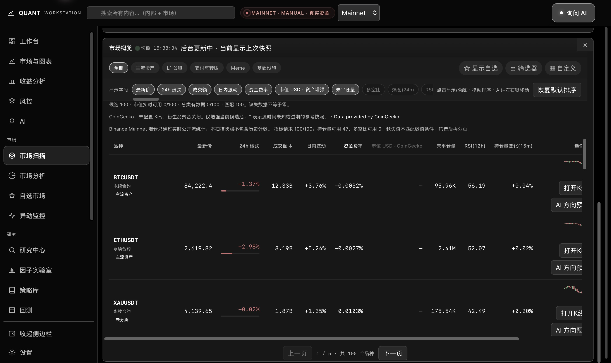

# STEDVOR / Quant Workstation

面向个人与中小团队的桌面量化工作站，将市场观察、研究与回测、Testnet 交易和记录核对连接起来。

**产品预览 · 公开下载准备中**

[English](README.md) · [版本范围](docs/editions.md) · [截图说明](docs/screenshots.md) · [反馈](docs/feedback.md)

实际软件中的公开行情列表。Mainnet 模式徽标不证明账户访问、实际下单或实盘结果。

## 三项用途

- **找到值得细看的市场。** 在同一候选列表组合筛选条件、排序、保存预设，并浏览迷你 K 线。
- **检验研究想法。** 结合历史收益、回撤与交易成本阅读结果。因子统计与因子收益回测支持进一步研究；通用策略回测和参数优化属于计划中的 Full 范围。
- **练习执行，核对记录。** 已确认的 Basic 范围包含受支持 Testnet 产品的人工交易与自动机器人，并衔接订单、成交和 Testnet 收益记录。

截图来自实际软件界面。回测图是尚未运行的配置，AI 图没有生成回答或预测结果。解释界面数值或环境徽标前，请阅读[截图说明](docs/screenshots.md)。

## 当前状态

现有本机候选已在 macOS Apple Silicon 构建和使用。独立 Basic 包、版本隔离、最终安装载体及干净设备首装仍待完成与验证。Intel macOS、Windows 和 Linux 发行包尚未验证。目前没有公开下载或购买入口。

[已确认的版本范围](docs/editions.md)规定 Basic 长期免费：九个页面、Testnet 人工交易与机器人、因子统计与因子收益回测。Full 计划收费，价格、付款与许可安排待确定。AI 和增强数据可能需要用户自备第三方 Key，并支付提供方额度费用。

本仓库用于产品展示和[需求、体验讨论](docs/feedback.md)。历史结果与 AI 模型估计不证明未来收益或预测准确率。
